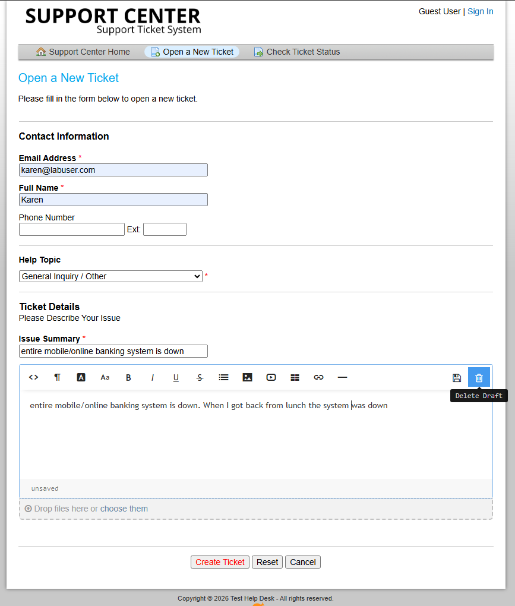
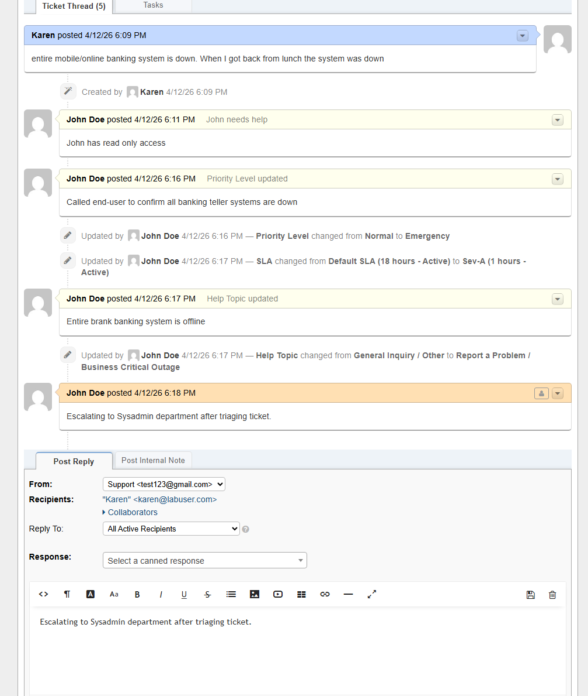
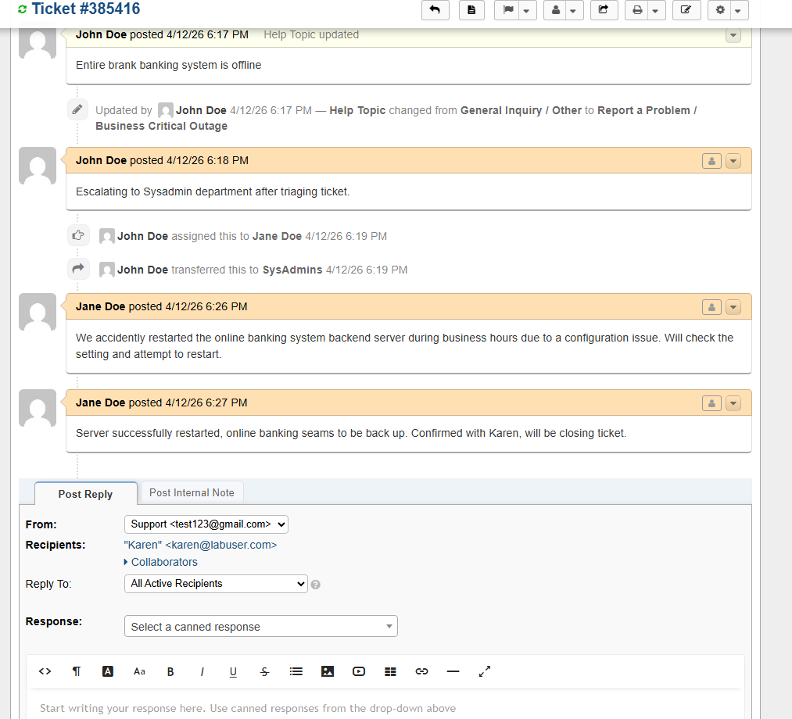
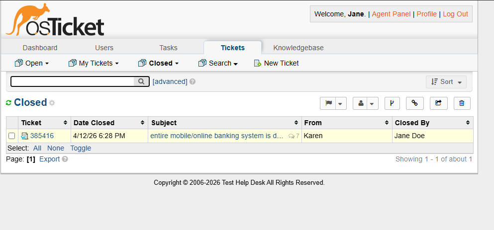

# 🛠️ IT Support Portfolio – Help Desk, Networking & Security Labs

> Hands-on IT support labs demonstrating incident management, ticketing systems, networking, and security concepts in a simulated production environment.

---

## 📌 Overview

This repository showcases multiple hands-on IT labs designed to simulate real-world IT support scenarios.

Projects include:

* Help desk ticketing and incident management (osTicket)
* Network security and VPN configuration (ProtonVPN)
* (Upcoming) Active Directory user and group management

---

## 🧰 Technologies Used

* Microsoft Azure (Virtual Machines)
* Windows 10
* osTicket (Help Desk Ticketing System)
* ProtonVPN
* Remote Desktop Protocol (RDP)

---

# 🛠️ Project 1: Help Desk Ticketing System (osTicket)

## 📌 Overview

Deployed and configured an osTicket help desk system in Azure and managed the full ticket lifecycle, including triage, escalation, SLA enforcement, and resolution.

---

## 💼 Skills Demonstrated

* Incident triage and prioritization
* SLA management (Sev-A, Sev-B, Sev-C)
* Ticket escalation workflows
* Role-based access control (RBAC)
* Internal documentation and communication
* End-user support and issue resolution

---

## 🚨 Incident Walkthrough: Banking System Outage

### 🟢 Ticket Created

### 🔴 Priority Escalated to Emergency

### ⏱️ SLA Updated

### 🔁 Escalated to SysAdmins

### 🛠️ Issue Resolved

### ✅ Ticket Closed

---

## 📈 Outcome

* Successfully handled multiple simulated incidents
* Demonstrated escalation and prioritization skills
* Completed full ticket lifecycle from intake to resolution
* Applied real-world IT support workflows

---

# 🔐 Project 2: VPN Lab (Network Security)

## 📌 Overview

Configured a Virtual Private Network (VPN) using ProtonVPN within an Azure virtual machine to demonstrate secure traffic tunneling and geographic IP masking.

---

## 💼 Skills Demonstrated

* VPN setup and configuration
* IP address tracking and verification
* Network traffic tunneling
* Geolocation analysis
* Secure remote connectivity

---

## 📈 Outcome

* Successfully routed traffic through a VPN tunnel
* Verified IP and geographic location changes
* Demonstrated understanding of encrypted network traffic
* Gained hands-on experience with network security concepts

---

## 🗂️ Repository Structure

screenshots/
├── tickets/
├── agents/
├── roles/
├── departments/
├── sla/
└── vpn/

---

## 🎯 Next Steps

Currently expanding skills in:

* Active Directory (user and group management)
* Networking fundamentals
* System administration

---

## 🤝 Connect With Me

* GitHub: https://github.com/ReynoA
* LinkedIn: https://www.linkedin.com/in/angel-reynoso-00359959/
